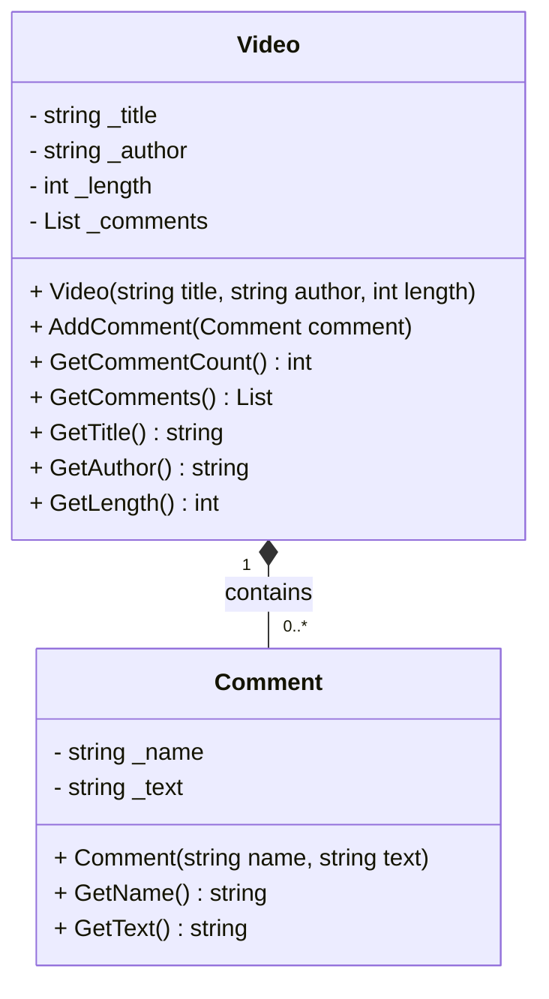

# Class Diagram 

```mermaid
classDiagram

class Video {
    - string _title
    - string _author
    - int _length
    - List<Comment> _comments
    + Video(string title, string author, int length)
    + AddComment(Comment comment)
    + GetCommentCount() int
    + GetComments() List<Comment>
    + GetTitle() string
    + GetAuthor() string
    + GetLength() int
}

class Comment {
    - string _name
    - string _text
    + Comment(string name, string text)
    + GetName() string
    + GetText() string
}

Video "1" *-- "0..*" Comment : contains
```