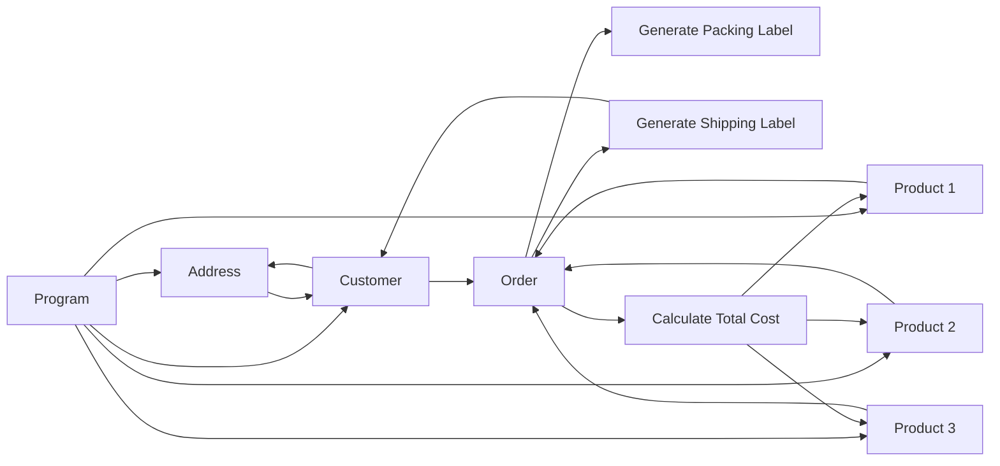

```mermaid
flowchart LR

    Program --> Address
    Program --> Customer
    Address --> Customer

    Program --> Product1[Product 1]
    Program --> Product2[Product 2]
    Program --> Product3[Product 3]

    Customer --> Order
    Product1 --> Order
    Product2 --> Order
    Product3 --> Order

    Order --> PackingLabel[Generate Packing Label]
    Order --> ShippingLabel[Generate Shipping Label]
    Order --> TotalCost[Calculate Total Cost]

    ShippingLabel --> Customer
    Customer --> Address

    TotalCost --> Product1
    TotalCost --> Product2
    TotalCost --> Product3
```