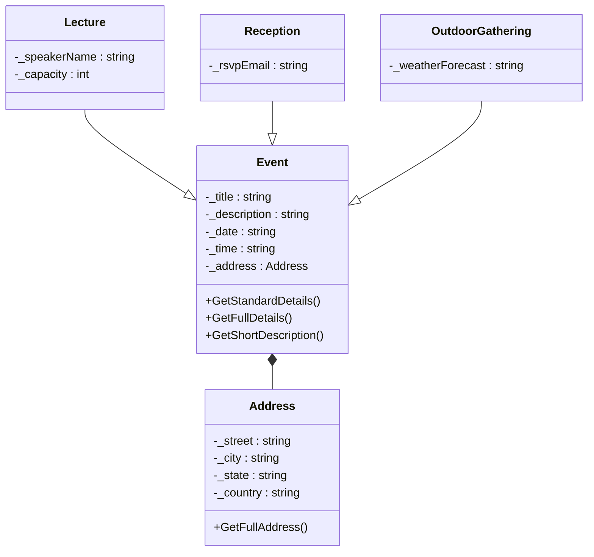

# Class Diagram

```mermaid
classDiagram

class Event {
    -_title : string
    -_description : string
    -_date : string
    -_time : string
    -_address : Address
    +GetStandardDetails()
    +GetFullDetails()
    +GetShortDescription()
}

class Lecture {
    -_speakerName : string
    -_capacity : int
}

class Reception {
    -_rsvpEmail : string
}

class OutdoorGathering {
    -_weatherForecast : string
}

class Address {
    -_street : string
    -_city : string
    -_state : string
    -_country : string
    +GetFullAddress()
}

Lecture --|> Event
Reception --|> Event
OutdoorGathering --|> Event
Event *-- Address
```