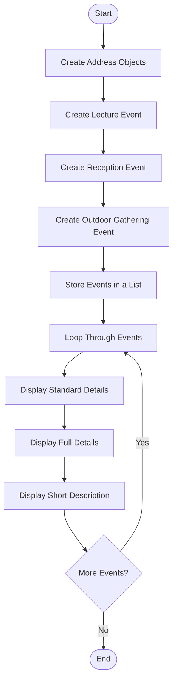

```mermaid
flowchart TD

    A([Start])

    B[Create Address Objects]

    C[Create Lecture Event]
    D[Create Reception Event]
    E[Create Outdoor Gathering Event]

    F[Store Events in a List]

    G[Loop Through Events]

    H[Display Standard Details]

    I[Display Full Details]

    J[Display Short Description]

    K{More Events?}

    L([End])

    A --> B
    B --> C
    C --> D
    D --> E
    E --> F
    F --> G
    G --> H
    H --> I
    I --> J
    J --> K
    K -->|Yes| G
    K -->|No| L
```