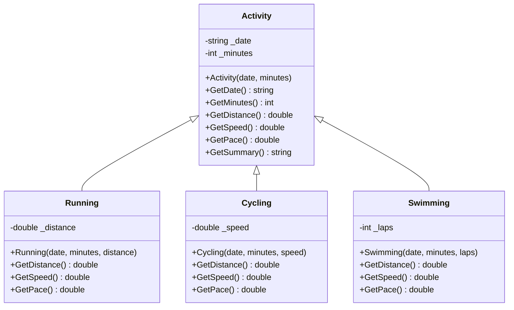

# Class Diagram

```mermaid
classDiagram

    class Activity {
        -string _date
        -int _minutes
        +Activity(date, minutes)
        +GetDate() string
        +GetMinutes() int
        +GetDistance() double
        +GetSpeed() double
        +GetPace() double
        +GetSummary() string
    }

    class Running {
        -double _distance
        +Running(date, minutes, distance)
        +GetDistance() double
        +GetSpeed() double
        +GetPace() double
    }

    class Cycling {
        -double _speed
        +Cycling(date, minutes, speed)
        +GetDistance() double
        +GetSpeed() double
        +GetPace() double
    }

    class Swimming {
        -int _laps
        +Swimming(date, minutes, laps)
        +GetDistance() double
        +GetSpeed() double
        +GetPace() double
    }

    Activity <|-- Running
    Activity <|-- Cycling
    Activity <|-- Swimming
```