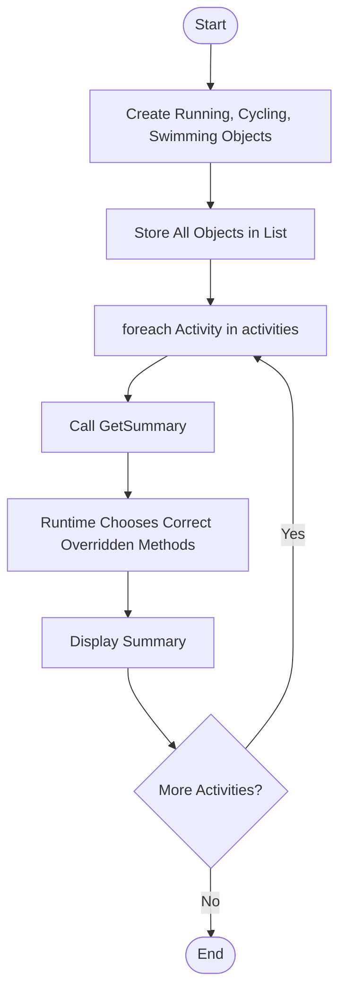

```mermaid
flowchart TD
    A([Start])
    B[Create Running, Cycling, Swimming Objects]
    C[Store All Objects in List<Activity>]
    D[foreach Activity in activities]
    E[Call GetSummary]
    F[Runtime Chooses Correct Overridden Methods]
    G[Display Summary]
    H{More Activities?}
    I([End])

    A --> B
    B --> C
    C --> D
    D --> E
    E --> F
    F --> G
    G --> H
    H -->|Yes| D
    H -->|No| I
```