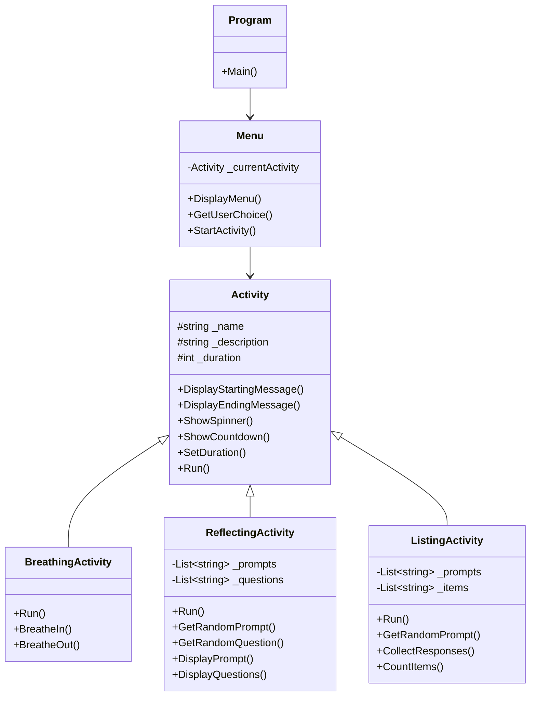

# Class Diagram

```mermaid
classDiagram
    Program --> Menu
    Menu --> Activity

    Activity <|-- BreathingActivity
    Activity <|-- ReflectingActivity
    Activity <|-- ListingActivity

    class Program{
        +Main()
    }

    class Menu{
        -Activity _currentActivity
        +DisplayMenu()
        +GetUserChoice()
        +StartActivity()
    }

    class Activity{
        #string _name
        #string _description
        #int _duration

        +DisplayStartingMessage()
        +DisplayEndingMessage()
        +ShowSpinner()
        +ShowCountdown()
        +SetDuration()
        +Run()
    }

    class BreathingActivity{
        +Run()
        +BreatheIn()
        +BreatheOut()
    }

    class ReflectingActivity{
        -List~string~ _prompts
        -List~string~ _questions

        +Run()
        +GetRandomPrompt()
        +GetRandomQuestion()
        +DisplayPrompt()
        +DisplayQuestions()
    }

    class ListingActivity{
        -List~string~ _prompts
        -List~string~ _items

        +Run()
        +GetRandomPrompt()
        +CollectResponses()
        +CountItems()
    }

```