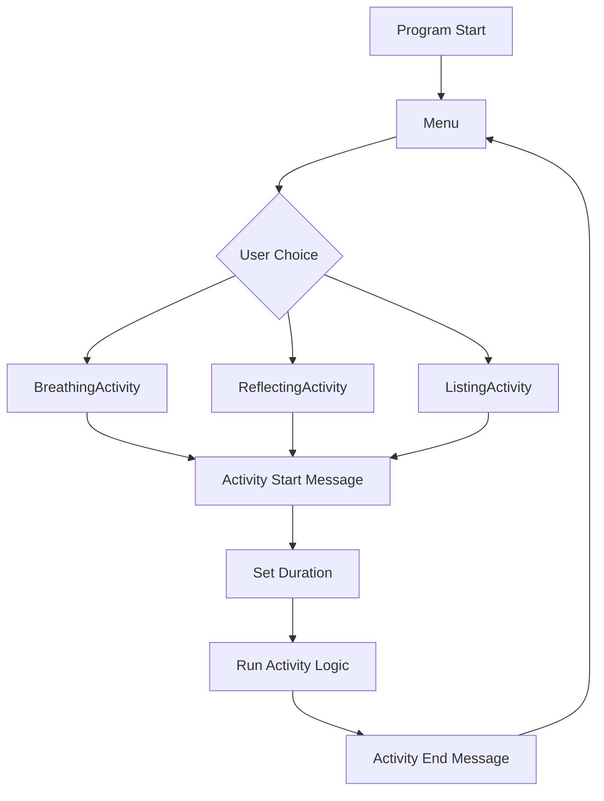

```mermaid
flowchart TD
    A[Program Start] --> B[Menu]

    B --> C{User Choice}

    C --> D[BreathingActivity]
    C --> E[ReflectingActivity]
    C --> F[ListingActivity]

    D --> G[Activity Start Message]
    E --> G
    F --> G

    G --> H[Set Duration]

    H --> I[Run Activity Logic]

    I --> J[Activity End Message]

    J --> B
```