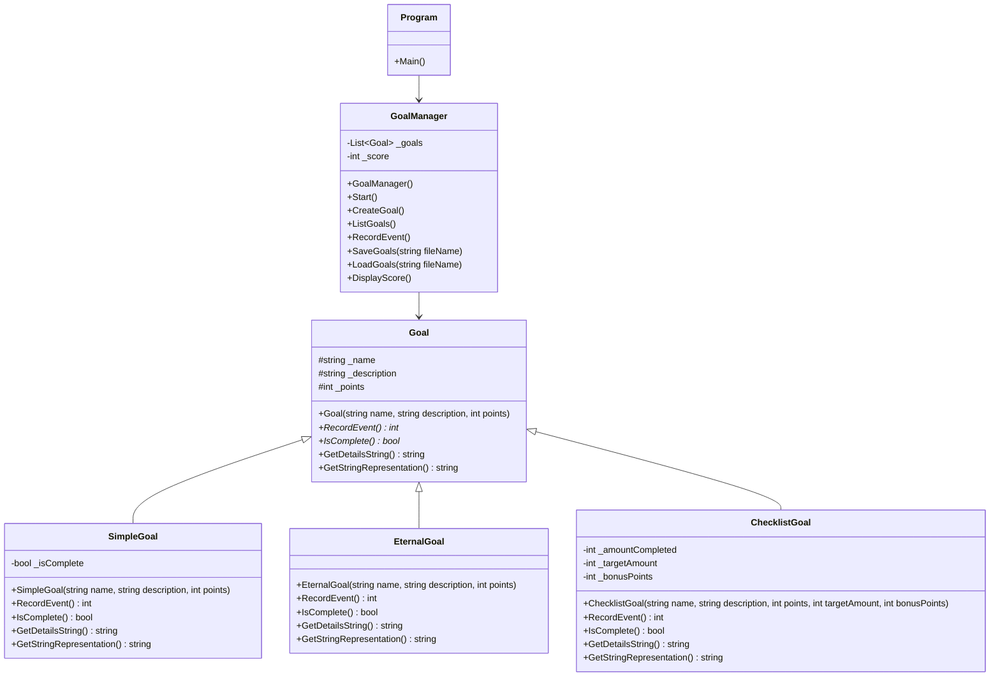

# Class Diagram

```mermaid
classDiagram
    class Program {
        +Main()
    }

    class GoalManager {
        -List~Goal~ _goals
        -int _score
        +GoalManager()
        +Start()
        +CreateGoal()
        +ListGoals()
        +RecordEvent()
        +SaveGoals(string fileName)
        +LoadGoals(string fileName)
        +DisplayScore()
    }

    class Goal {
        #string _name
        #string _description
        #int _points

        +Goal(string name, string description, int points)

        +RecordEvent()* int
        +IsComplete()* bool

        +GetDetailsString() string
        +GetStringRepresentation() string
    }

    class SimpleGoal {
        -bool _isComplete

        +SimpleGoal(string name, string description, int points)
        +RecordEvent() int
        +IsComplete() bool
        +GetDetailsString() string
        +GetStringRepresentation() string
    }

    class EternalGoal {
        +EternalGoal(string name, string description, int points)
        +RecordEvent() int
        +IsComplete() bool
        +GetDetailsString() string
        +GetStringRepresentation() string
    }

    class ChecklistGoal {
        -int _amountCompleted
        -int _targetAmount
        -int _bonusPoints

        +ChecklistGoal(string name, string description, int points, int targetAmount, int bonusPoints)
        +RecordEvent() int
        +IsComplete() bool
        +GetDetailsString() string
        +GetStringRepresentation() string
    }

    Program --> GoalManager
    GoalManager --> Goal

    Goal <|-- SimpleGoal
    Goal <|-- EternalGoal
    Goal <|-- ChecklistGoal
```