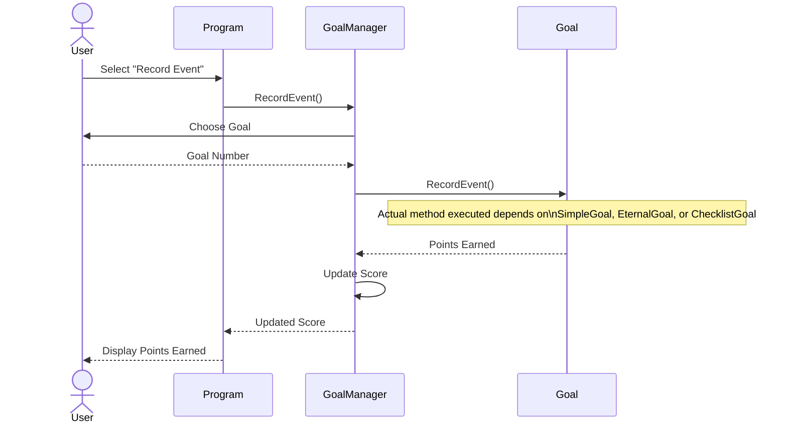

```mermaid
sequenceDiagram

actor User
participant Program
participant GoalManager
participant Goal

User->>Program: Select "Record Event"
Program->>GoalManager: RecordEvent()

GoalManager->>User: Choose Goal
User-->>GoalManager: Goal Number

GoalManager->>Goal: RecordEvent()

Note over Goal: Actual method executed depends on\nSimpleGoal, EternalGoal, or ChecklistGoal

Goal-->>GoalManager: Points Earned

GoalManager->>GoalManager: Update Score

GoalManager-->>Program: Updated Score
Program-->>User: Display Points Earned
```